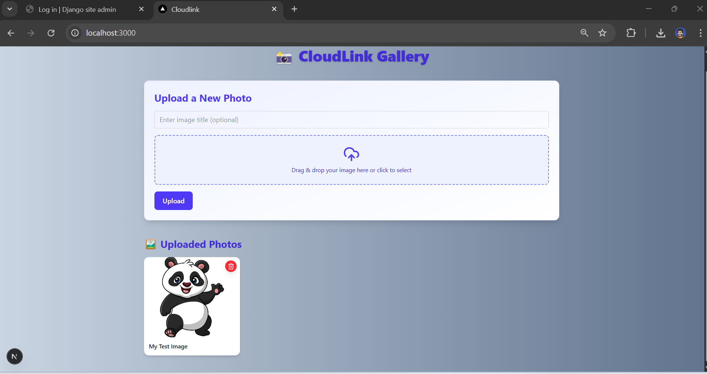

# 📸 CloudLink – Django + Next.js S3 Image Gallery

CloudLink is a full-stack image gallery application that lets users upload and view images with a clean UI. Images are stored securely on AWS S3 and managed via a Django backend and a modern Next.js frontend.

---

## 🔧 Project Setup

### 1. Clone the repository

```bash
git clone https://github.com/NoManNayeem/CloudLink.git
cd cloudlink
```

### 2. Backend Setup (Django)

```bash
cd cloudlink
python -m venv venv
venv\Scripts\activate      # On Windows
pip install -r requirements.txt
python manage.py migrate
python manage.py runserver
```

Make sure a valid `.env` file with AWS and Django secrets is placed inside the `cloudlink/` directory.

### 3. Frontend Setup (Next.js)

```bash
cd ../cloudlink-ui
npm install
npm run dev
```

Open the frontend at: [http://localhost:3000](http://localhost:3000)

---

## 📁 Project Structure

```
DRF+S3/
├── cloudlink/       # Django backend
│   ├── api/         # API app with models, views
│   ├── cloudlink/   # Project settings and config
│   ├── .env         # Secrets and AWS credentials
│   ├── db.sqlite3   # Local development DB
│   └── manage.py
├── cloudlink-ui/    # Next.js frontend
│   ├── public/
│   ├── src/
│   └── package.json
├── myIMG.jpg        # Sample image (optional)
└── screenshot/      # 📸 Screenshots for this README
```

---

## 🖼 Screenshot

Include your UI screenshot in a folder named `./screenshot/` and display it here:



---

## 📌 Notes

- The uploaded images are stored in Amazon S3
- Image delete requests also remove them from S3 (via overridden model delete method)
- No authentication included (can be added easily later)